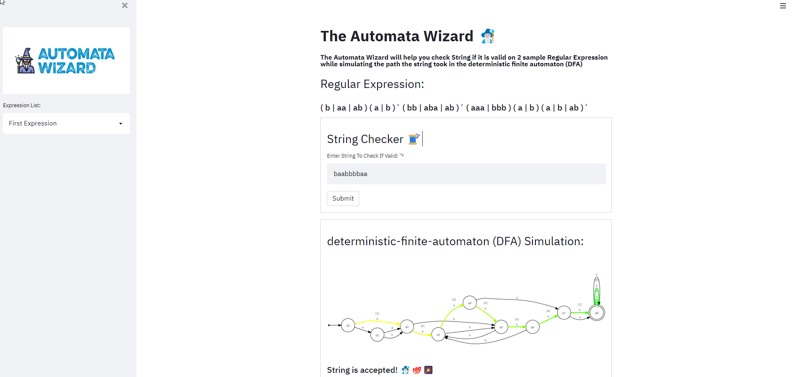

# Automata Wizard
---


## About
The Automata Wizard will help you check String if it is valid on 2 sample Regular Expression while simulating the path the string took in the deterministic finite automaton (DFA)

A Project required in S-CSP315 Course

Preview Project in your browser using the link below hosted by Heroku

#### Frontend

- Streamlit


#### Backend/Database

- 

## Installation

### 1. Clone Repo
```
git clone https://github.com/LeandroMartinMacato/Automata_Project
```

### 2. pip install -r requirements.txt
```
pip install -r requirements.txt
```

### 3. Run Python Streamlit File
```
python main.py
```

## Preview

[Preview WebApp](https://automata-wizard.herokuapp.com/)

## Screenshot


